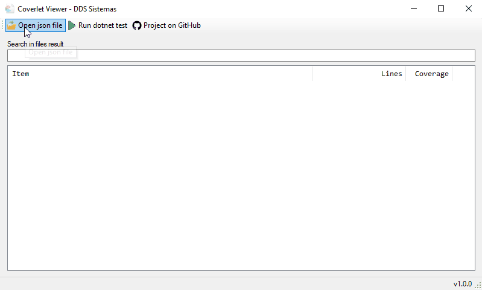

# CoverletViewer

CoverletViewer is a viewer of JSON files produced by Coverlet. It also has a feature that allows you to select a C # project solution to run the tests with the Coverlet parameters and already view the results in sequence.

## Download Binaries
[1.0.1](https://github.com/ddsdaniel/CoverletViewer/blob/master/binaries/1.0.1.zip)
